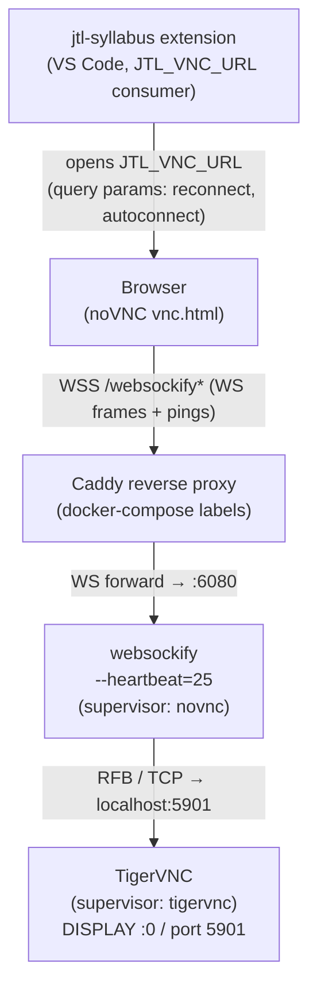

<!-- CLASI: Before changing code or making plans, review the SE process in CLAUDE.md -->

# Architecture Update — Sprint 001: Fix noVNC connection drops / idle WebSocket timeouts

## What Changed

### 1. `[program:novnc]` supervisor command (app/conf.d/novnc.conf)

The supervisor command for the noVNC program block is replaced. The previous
invocation used the `novnc_proxy` shell-script wrapper; the new invocation calls
`websockify` directly with an explicit `--heartbeat=25` flag:

- **Before**: `command=/usr/share/novnc/utils/novnc_proxy --listen 6080 --vnc localhost:5901`
- **After**: `command=websockify --heartbeat=25 --web /usr/share/novnc 6080 localhost:5901`

The stale comment on line 1 (`; --- TigerVNC built-in server on DISPLAY :1 ---`)
is also corrected to `:0` to match the actual display in use.

No other fields in the `[program:novnc]` block change (`user=root`,
`autorestart=true`, log paths all unchanged).

### 2. `JTL_VNC_URL` environment variable (docker-compose.yaml)

The URL appends noVNC query parameters that enable client-side auto-reconnect:

- **Before**: `JTL_VNC_URL=https://codespace.doswarm.jointheleague.org/vnc/`
- **After**: `JTL_VNC_URL=https://codespace.doswarm.jointheleague.org/vnc/?autoconnect=true&reconnect=true&reconnect_delay=2000`

These are native `vnc.html` settings interpreted by the stock noVNC client from
the query string at page load time. No JavaScript or HTML changes are required.

## Why

VNC/RFB transmits bytes only when the screen changes. A static framebuffer
produces zero bytes on the WebSocket, which causes network intermediaries —
school/corporate firewalls, NAT gateways, Cloudflare's ~100s idle WebSocket
limit — to close the connection with WS close code 1006.

The `novnc_proxy` wrapper does not guarantee forwarding of `--heartbeat` to
its underlying `websockify` invocation. Calling `websockify` directly ensures
the 25-second ping interval is unconditionally active, making the socket appear
live to every hop in the path, including those outside our control.

The client auto-reconnect parameters address the residual case: if a drop
occurs despite the heartbeat (e.g. a brief Caddy restart or brief network
interruption), the noVNC browser client reconnects after 2 seconds instead of
requiring a manual page reload.

These changes resolve UC-003 ("noVNC Session Drops Due to Idle Timeout"), which
is explicitly marked in `docs/clasi/overview.md` as a known issue.

## Component / Module Diagram

- **Changed nodes**: Websockify (new `--heartbeat` flag); Browser (new query params via JTL_VNC_URL).
- **Unchanged nodes**: Caddy (no label changes), TigerVNC, Extension (passes URL through).
- **Edge labels** show the protocol at each boundary.

## Impact on Existing Components

| Component | Impact |
|-----------|--------|
| `app/conf.d/novnc.conf` | `[program:novnc]` command line replaced. Supervisord will restart `novnc` after image rebuild and container start; behavior is otherwise identical. |
| `docker-compose.yaml` | One environment variable value extended. No structural change to labels, networks, or service definition. |
| `Dockerfile` | No change. `websockify` is already on PATH via `python3-websockify` (a dependency of `novnc` apt package, line 34). `COPY ./app /app` at line 51 will pick up the changed `novnc.conf` on the next `docker compose build`. |
| Caddy reverse proxy | No change. Caddy's WebSocket handling already works correctly; no idle-timeout label is needed. |
| TigerVNC / display | No change. The RFB target (`localhost:5901`) and display (`:0`) are unchanged. |
| jtl-syllabus extension | No change to this repo. Extension must pass `JTL_VNC_URL` through verbatim for query params to reach the browser (verification required; if it strips query strings, that fix belongs in the extension repo). |
| Supervisor group `novnc` | No change. `[group:novnc]` membership (`desktop-preflight,tigervnc,novnc`) is unchanged. |

## Migration Concerns

**Image rebuild required.** The `novnc.conf` file is baked into the image at
build time via `COPY ./app /app` (Dockerfile line 51). Editing the file in place
on a running container is insufficient — the fix only takes effect after
`docker compose build && docker compose up -d` (or the equivalent swarm/doswarm
deploy). Running containers continue with the old (no-heartbeat) behaviour until
redeployed.

**No data migration.** These are pure configuration changes. No persistent data,
storage schema, or environment variables with stored state are affected.

**Backward compatibility.** The new `websockify` invocation is equivalent in
every externally visible respect to the old `novnc_proxy` invocation: same port
(6080), same RFB target (localhost:5901), same `/usr/share/novnc` web root, same
`user=root`. The `--heartbeat` flag adds traffic on existing connections; it does
not change any interface or protocol.

## Design Rationale

**Why direct websockify instead of novnc_proxy with --heartbeat?**
The `novnc_proxy` wrapper is a thin shell script that constructs a `websockify`
command from its own flags. Whether a flag like `--heartbeat` is forwarded
depends on the specific script version; some versions silently drop unknown
flags. Calling `websockify` directly eliminates this uncertainty: the flag is
unconditionally present in the process `argv`. The functional outcome is
identical — `novnc_proxy` is documented to be a convenience wrapper for exactly
this invocation pattern.

**Why 25 seconds for the heartbeat interval?**
School and corporate firewalls commonly use a 60-second idle timeout.
25 seconds provides more than 2x safety margin. Cloudflare's idle WebSocket
limit is ~100 seconds; 25s beats it by 4x. If testing reveals a more aggressive
firewall (<60s), the interval can be lowered to 15 without any other change.

**Why query-string reconnect instead of custom JS?**
The stock `novnc` apt package ships the standard noVNC `vnc.html` client, which
reads `reconnect`, `reconnect_delay`, and `autoconnect` from `URLSearchParams`
at page load. This is a first-class, documented feature of the noVNC project.
Using it requires only a URL change — no custom HTML, no patched JS, no build
step. The custom `RFB` JS approach from the generic reference guide
(`.clasi/issues/fixing-novnc-timeouts.md`) applies to embedding noVNC, not to
the standalone hosted client, which is what this stack uses.

## Open Questions

1. **jtl-syllabus URL passthrough**: Does the extension open `JTL_VNC_URL`
   verbatim (including the query string) or does it reconstruct the URL
   programmatically? If it strips the query string, the reconnect params need
   to be set in the extension, not in `docker-compose.yaml`. **Must be verified
   during Ticket 002.** If stripped, a follow-on issue should be filed against
   the extension repo.

2. **Cloudflare presence**: Is `codespace.doswarm.jointheleague.org` currently
   orange-cloud (Cloudflare proxy) or grey-cloud (DNS only)? If Cloudflare is
   proxying WebSockets, the ~100s idle cap applies (defeated by `--heartbeat=25`,
   no action needed). If grey-cloud, Cloudflare's cap does not apply.
   **Document finding in Ticket 003.**

3. **Aggressive firewall floor**: If the idle test still drops before 60 seconds
   after Layer 1 is deployed, lower `--heartbeat` from 25 to 15. No architectural
   change — a single number edit. Not expected but noted for the team-lead.
